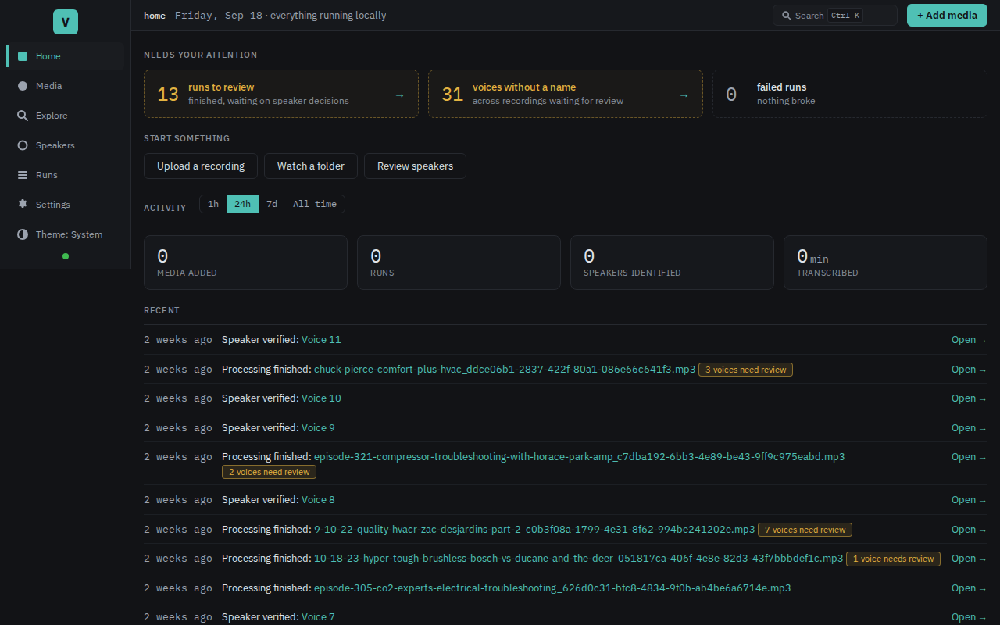
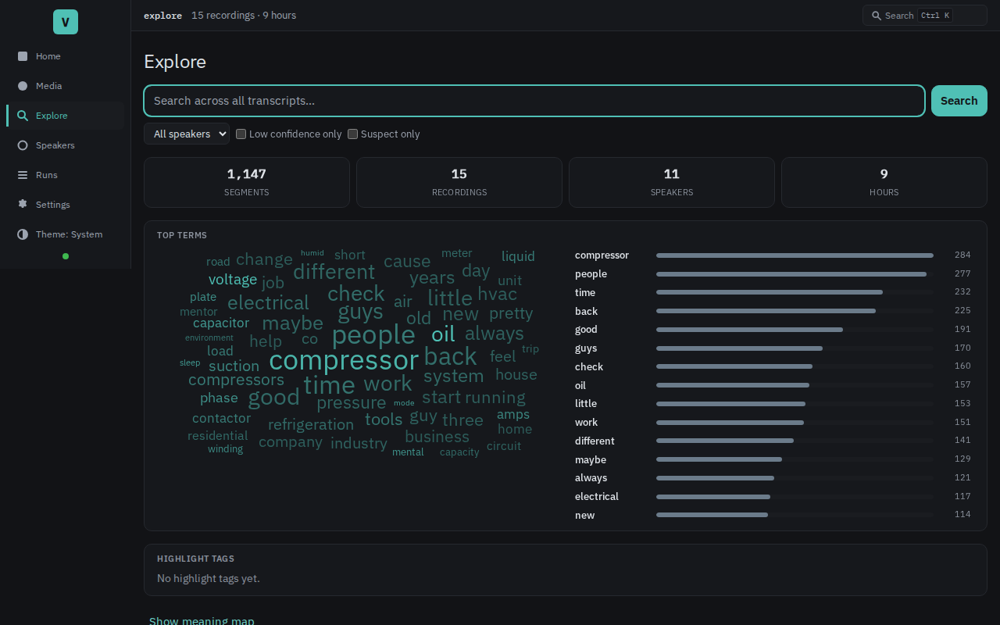
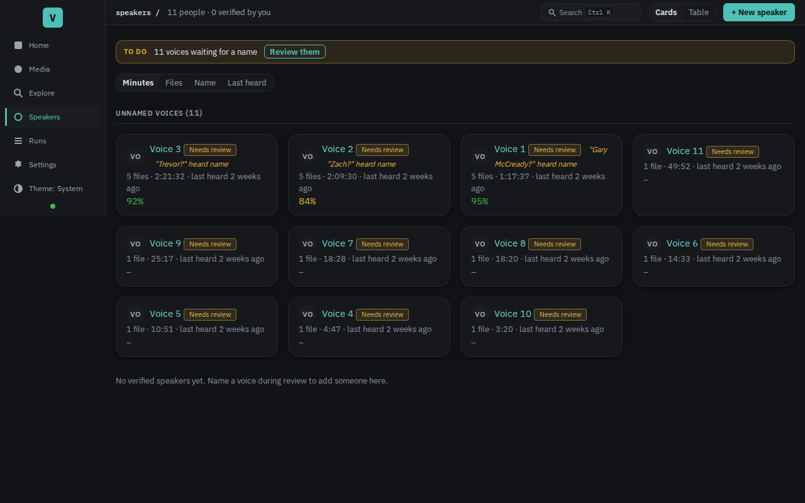

# Voxint

**An open, self-hosted speech intelligence platform for small teams,
journalists, and researchers who want full control over their audio corpus.**

Voxint transcribes audio and video, separates and identifies voices across
recordings, and opens a review console where you confirm each speaker and
correct the wording before you export. Automated suggestions stay separate from
your rulings. You always have the final say.

Built for researchers, journalists, educators, and small teams whose
recordings need to stay local. No cloud account, no per-minute fees,
nothing uploaded. One install gives you transcription, speaker separation,
voice recognition, and a searchable corpus on hardware you control.

Your audio is processed locally by default. Two optional features reach the
network when you turn them on: fetching a recording from a URL, and sending
transcript text to an outside AI model to polish the wording. Both are off
or opt-in, and clearly labelled.

Voxint stands on the shoulders of remarkable open-source work in speech and
audio: faster-whisper, pyannote.audio, NeMo's TitaNet, yt-dlp, and many
others. These projects made state-of-the-art speech intelligence accessible
to developers; Voxint's job is to make it accessible to everyone else. Thank
you to every contributor.

> **Status: beta (v0.43), approaching 1.0.** The pipeline, review console,
> CLI, API, and export path are in daily use, held to ~4,800 tests, full
> CI/CD, GPU parity gates, and contract tests that pin model outputs. The
> project follows 0.x semver: interfaces and database schemas can still
> change between minor releases. Pin a release for work you cannot re-do,
> and back up your data before upgrading. See the
> [changelog](CHANGELOG.md) for what changed in each version.


## See it in action

*(All screenshots use small synthetic sample recordings, never real audio.)*

| | |
|---|---|
|  |  |
| **Your review queue**: completed recordings waiting for your decisions. | **Review only the uncertain voices**: strong matches are shown automatically; you confirm the possible ones and rule on the rest. |
|  |  |
| **Guided setup in the browser**: honest readiness checks, plain-language fixes. | **Home** shows what needs your attention and how to add a recording. |
|  |  |
| **Explore**: search across every transcript by meaning or exact words. | **Speaker roster**: manage voices across all your recordings. |

## What it does

Voxint takes a recording and walks it through four steps:

1. **Add your recording**: upload it in the browser (single files or a
   batch), paste a URL, drop files into a watched folder, or point Voxint
   at a file it can already see.
2. **Voxint does the heavy lifting**: it transcribes the words and works out
   who spoke when, then suggests who each voice is by comparing it against
   a roster that grows as you use it.
3. **You review**: confirm each speaker, and fix any wording, in a console
   built for exactly this. Automated suggestions stay separate from your
   decisions; you always have the final say.
4. **Read or export**: read a finished transcript on screen, or download a
   clean, speaker-labelled copy (plain text, Markdown, subtitles, or
   structured data).

Once you have a few transcripts, you can also **search across all of them
by meaning**, not only by the exact words. Type what you are looking for
and Voxint finds the closest passages from every recording, each with a
link straight to that spot. This search runs locally too.

## Capabilities

### Bring media in

- Audio files (WAV, MP3, FLAC, OGG, AAC, and more) and video files (MP4,
  MKV, MOV, WebM, AVI). Voxint extracts the audio track automatically.
- Upload one file or many at once, with per-file progress. Paste a URL and
  Voxint fetches the recording (YouTube and other sites, via yt-dlp).
- Point Voxint at a **watched folder** and new files are picked up
  automatically, with settle detection so nothing is grabbed mid-copy.
- Attach a YAML sidecar to any file for per-recording metadata, vocabulary,
  or speaker hints.

### Organize your work

- **Projects and folders** group recordings around a research question, a
  reporting beat, or a course.
- Per-project **vocabularies** feed names and specialist terms into
  transcription so they come out right the first time.
- Per-project **domain packs** carry correction rules that fix repeated
  errors across every recording in the project.
- **Learned corrections** watch your edits: after you fix the same mistake
  three times, Voxint suggests a rule. You accept or dismiss it.

### Transcribe, separate, and identify voices

- Transcription (Whisper large-v2), speaker separation (pyannote 3.1), and
  voice identification (TitaNet) run in one pipeline. Everything they need
  is bundled in, so there is **no Hugging Face account or token** to set up.
- A **speaker roster** grows as you review. Merge duplicates, split
  misattributions, reassign segments, and manage voice samples. Voices
  recognized in one recording carry over to the next.
- Optional **LLM polish** sends transcript text to any OpenAI-compatible
  endpoint to tidy the wording. A bundled local model (Qwen3-4B, Apache-2.0)
  works without an API key. You can also point it at your own llama.cpp,
  vLLM, or Ollama instance.
- Optional **translation** renders the transcript in another language,
  side by side with the original.

### Review in the console

- **Walk mode**: step through the transcript segment by segment with
  auto-play, confirming speakers and fixing wording as you go.
- **Waveform strip**: click to seek, drag to select a time range, play
  just the selection.
- **Keyboard shortcuts** for every common action (verify, skip, replay,
  edit, next/prev, digit-assign speaker, annotate, download).
- **Click-to-edit** any segment's text or speaker inline.
- **Speaker rail**: an exception-review sidebar that groups voices by
  status (needs you, too little speech, matched automatically, your
  rulings). One click to confirm a match, one click to hear the voice.
- **Annotations**: highlight a passage, add a note or a tag, extract an
  audio clip from the highlighted words.
- **Command palette** (Ctrl+K): search commands, recordings, speakers,
  projects, and transcript passages in one place.
- **Real-time progress**: a live pipeline dashboard shows what is
  processing, per-stage timing, and estimated completion. Completion
  notifications arrive via server-sent events within seconds.

### Search and explore

- **Semantic search** finds passages by meaning across every transcript,
  not only by the exact words. Three search arms (vector similarity,
  lexical match, exact quote) are fused into one ranked result.
- **KWIC concordance**: keyword-in-context results with filters by project,
  speaker, date range, and confidence.
- **Meaning map** and **word cloud** visualize the shape of your corpus.
- **Saved quotes**: bookmark a passage with a note; export a project's
  quotes as CSV.

### Export

- Plain text, Markdown, SubRip subtitles (.srt), WebVTT (.vtt), JSON, and
  RTTM diarization format.
- Annotation pull-quotes export as Markdown with audio-clip attribution.
- Saved-quote board exports as CSV.

### Run it your way

- **NVIDIA GPU** (CUDA 12.8, Blackwell-ready), **AMD GPU** (ROCm),
  **CPU-only**, or **Apple Silicon** (native Metal preview, no Docker
  needed on Mac).
- Single operator by default. Turn on **multi-user mode** and each person
  gets their own login with one of three roles (admin, reviewer, viewer),
  with decisions attributed to whoever made them.
- **CLI** for scripting and automation (`voxint submit`, `fetch`, `export`,
  `restart`, `doctor`, `stats`, `benchmark`, and more).
- **HTTP API** (v1) with bearer-token auth for programmatic access: upload,
  fetch, list runs, cancel/pause/resume, and export transcripts.
- **Plugin architecture** for new capabilities. The shipped synthdetect
  plugin scores audio turns for AI-generated speech.
- Apache-2.0. See [LICENSE](LICENSE).

## Quickstart

You need **[Docker](https://docs.docker.com/get-started/get-docker/) with the
Compose plugin (v2.24 or newer)**. One command takes a fresh copy to a running
console:

```bash
git clone https://github.com/bengizmo/voxint.git && cd voxint
./scripts/install.sh
```

The installer asks only for what it cannot invent (an admin password, a folder
for your media, and which hardware runs the models), then generates everything
else, starts Voxint, waits until it is healthy, and prints the console address.

> **On an Apple Silicon Mac and would rather not install Docker Desktop?** A
> docker-free **native preview** runs the whole stack under macOS's own service
> manager instead. It is a macOS-only technical preview (a few shell commands,
> not the one-command install above), so read
> [docs/native-macos-preview.md](docs/native-macos-preview.md) if that is you.
> Every other install path, on any operating system, needs Docker.

> **No graphics card? That is fine.** Voxint runs the whole pipeline on an
> ordinary computer's CPU (needs roughly **8 GB of memory** free). It is slower,
> and a long recording can take hours rather than minutes, but it works anywhere.
> A GPU (NVIDIA, AMD, or an Apple Silicon Mac) makes it faster.

> **Have a GPU? How much VRAM you need.** The transcription suite (Whisper +
> pyannote + TitaNet) shares one card and fits comfortably on **8 GB** (e.g. RTX
> 3050/3060 Ti/4060). Turning on the optional bundled local LLM adds ~5 GB, so
> running everything on one card wants **12 GB** (e.g. RTX 3060 12 GB) or more.
> AMD cards work via the ROCm tier. Full breakdown and card examples:
> [docs/setup.md](docs/setup.md#nvidia-gpu--the-fast-path).

When it finishes, open the console at **`http://127.0.0.1:8080/`** and sign in
with the username and password you set. On a fresh install Voxint walks you
through a short in-browser **setup wizard** and an optional **guided tutorial**
on the bundled sample, so you see the whole review loop before pointing it at
your own audio.

**Full setup for your operating system and hardware:
[docs/setup.md](docs/setup.md).**
First-run walkthrough: [docs/onboarding.md](docs/onboarding.md).

## Using Voxint

Once it is running, these short guides cover the day-to-day tasks:

- **[Add media and manage runs](docs/how-to/add-media-and-manage-runs.md)**:
  upload a file, paste a URL, or watch a folder; follow a run and requeue,
  cancel, restart, or archive it.
- **[Review and adjudicate](docs/how-to/reviewing-and-adjudicating.md)**:
  confirm speakers, correct the transcript, keyboard shortcuts, the waveform,
  splitting and reassigning segments.
- **[Manage speakers and export](docs/how-to/managing-speakers-and-exporting.md)**:
  the speaker roster, merging and splitting, and the export formats.
- **[Settings and troubleshooting](docs/how-to/settings-and-troubleshooting.md)**:
  configure everything from the browser, and fix common problems.
- **[Translate transcripts](docs/how-to/translating-transcripts.md)**:
  generate a translated version and read it side by side.
- **[Check for AI-generated speech](docs/how-to/checking-for-ai-generated-speech.md)**:
  score recordings for synthetic speech risk.
- **[Change pipeline models](docs/how-to/changing-pipeline-models.md)**:
  override the default Whisper or pyannote model.

## For developers

The console is server-rendered (FastAPI + Jinja + htmx) with small React
"islands" for interactive components. Three model services (whisper, pyannote,
titanet) run as separate containers behind versioned `/v1` HTTP contracts.
Celery handles the pipeline work queue; PostgreSQL with pgvector stores
everything.

```bash
uv sync --extra dev          # install (Python >= 3.11)
uv run ruff check .          # lint
uv run mypy                  # strict type-checking
uv run pytest tests/unit     # fast unit tests (~2 min with xdist)
```

Full stack with Docker: layer the build overlays on the compose files. Without
Docker at all: `uv run uvicorn voxint.api.app:app --reload`.

There is also a standalone, database-free scoring harness. `pip install voxint`
gives you the `voxint score` CLI for speaker-attribution metrics (see
[`examples/`](examples/README.md)).

| Want to... | Start here |
|---|---|
| Understand the architecture | [docs/architecture.md](docs/architecture.md) |
| Read the model contracts | [docs/gpu-contracts.md](docs/gpu-contracts.md) |
| Run the test suite | [docs/testing.md](docs/testing.md) |
| Write a plugin | [docs/plugins.md](docs/plugins.md) |
| Operate a deployment | [docs/operations.md](docs/operations.md) |
| All docs | [docs/README.md](docs/README.md) |

**Tests.** Unit and contract tests are the PR bar. Integration tests need
Postgres. GPU parity and browser acceptance lanes are maintainer-run. The suite
runs in parallel via pytest-xdist; a typical `tests/unit` run finishes in about
two minutes.

## Contributing

Contributions are welcome. Whether you are fixing a typo, writing a plugin,
improving accessibility, testing on new hardware, or reporting what happened
when you tried Voxint on real recordings, there is a place for it.

Good starting points:

- Look for issues labelled `good first issue` or `help wanted`.
- **Plugins** are the lowest-friction way to add a capability without touching
  the pipeline core. See [docs/plugins.md](docs/plugins.md).
- **Documentation and how-to guides** for workflows we have not covered yet.
- **Hardware reports**: if you ran Voxint on a GPU or platform we have not
  tested, tell us how it went.

Read [CONTRIBUTING.md](CONTRIBUTING.md) for the development setup, ground
rules, and how changes land. Report security issues privately via
[SECURITY.md](SECURITY.md).

## License

Apache-2.0. See [LICENSE](LICENSE) and [NOTICE](NOTICE). Vendored model weights
are redistributed under their own licenses with attribution (titanet:
CC-BY-4.0; pyannote segmentation: MIT; WeSpeaker embedding: CC-BY-4.0). See the
provenance files under `services/*/models/` and the model-asset releases.
