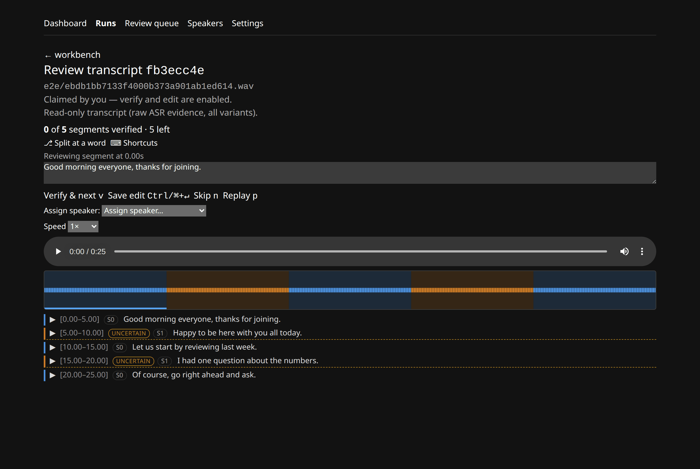
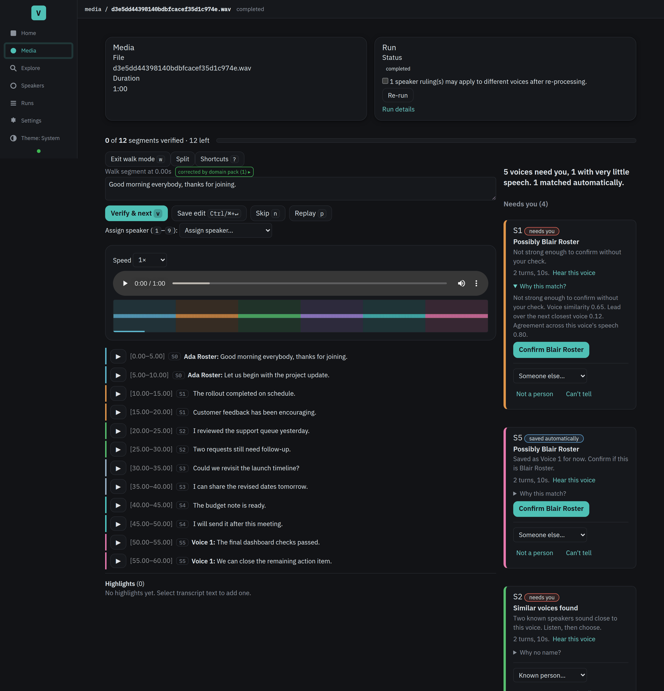
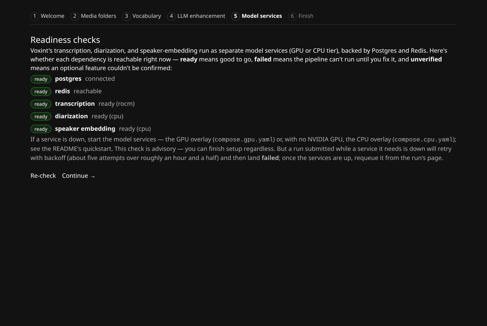
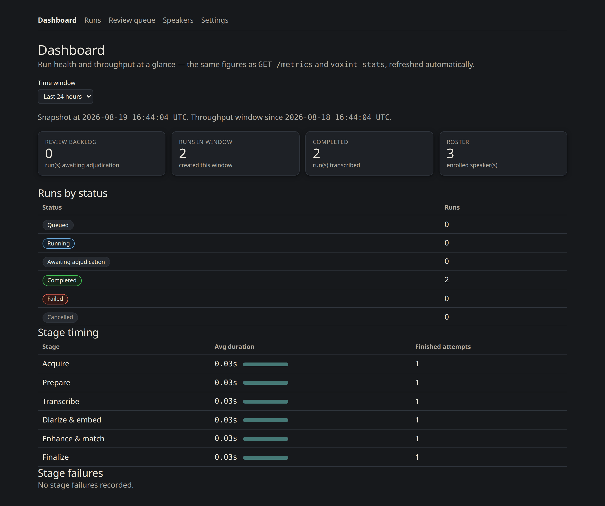

# Voxint

**Turn any recording into a speaker-labelled transcript — on your own
computer.** Voxint transcribes your audio or video, works out who spoke when,
and gives you a simple review screen to confirm the speakers and fix the wording
before you export.

It is built for individuals and small teams — researchers, journalists,
educators — who need their recordings to stay local. **Your audio is transcribed
on your own hardware by default:** no cloud account, no per-minute fees, nothing
uploaded. (Two optional features *do* reach the network when you turn them on:
fetching a recording from a URL, and sending transcript text to an outside AI
model to polish it. Both are off or opt-in, and clearly labelled.)

> **Early days (pre-alpha).** Voxint works end to end, but it is young software.
> The interface, database, and settings can still change between releases through
> the 0.x series. Great for hands-on use and feedback; not yet for
> mission-critical archives.



## See it in action

*(All screenshots use a small synthetic three-speaker sample that ships with
Voxint.)*

| | |
|---|---|
|  |  |
| **Your review queue** — completed recordings waiting for your decisions. | **Attribute each voice** — accept a confident match, judge a heard name, or leave a voice unknown. |
|  |  |
| **Guided setup in the browser** — honest readiness checks, plain-language fixes. | **A dashboard** for run health and throughput at a glance. |

## What it does

Voxint takes a recording and walks it through four steps:

1. **Add your recording** — upload it in the browser, paste a URL, or point
   Voxint at a file it can already see.
2. **Voxint does the heavy lifting** — it transcribes the words and works out
   who spoke when, then suggests who each voice is.
3. **You review** — confirm each speaker, and fix any wording, in a screen built
   for exactly this. Machine guesses stay separate from your decisions; you
   always have the final say.
4. **Export** — download a clean, speaker-labelled transcript (plain text,
   subtitles, or structured data).

The models all run **locally** — transcription (Whisper), speaker separation
(pyannote), and voice identity (TitaNet). Everything they need is bundled into
Voxint, so there is **no Hugging Face account or token** to set up.

## Quickstart

You need **[Docker](https://docs.docker.com/get-started/get-docker/) with the
Compose plugin (≥ 2.24)**. One command takes a fresh copy to a running console:

```bash
git clone https://github.com/bengizmo/voxint.git && cd voxint
./scripts/install.sh
```

The installer asks only for what it can't invent — an admin password, a folder
for your media, and which hardware runs the models — then generates everything
else, starts Voxint, waits until it is healthy, and prints the console address.

> **No graphics card? That's fine.** Voxint runs the whole pipeline on an
> ordinary computer's CPU (needs roughly **8 GB of memory** free). It is slower —
> a long recording can take hours rather than minutes — but it works anywhere. A
> GPU (NVIDIA, AMD, or an Apple Silicon Mac) just makes it faster.

> **Have a GPU? How much VRAM you need.** The transcription suite (Whisper +
> pyannote + TitaNet) shares one card and fits comfortably on **8 GB** (e.g. RTX
> 3050/3060 Ti/4060). Turning on the optional bundled local LLM adds ~5 GB, so
> running everything on one card wants **12 GB** (e.g. RTX 3060 12 GB) or more.
> AMD cards work via the ROCm tier. Full breakdown and card examples →
> [docs/setup.md](docs/setup.md#nvidia-gpu--the-fast-path).

When it finishes, open the console at **`http://127.0.0.1:8080/`** and sign in
with the username and password you set. On a fresh install Voxint walks you
through a short in-browser **setup wizard** and an optional **guided tutorial**
on the bundled sample, so you see the whole review loop before pointing it at
your own audio.

**Full setup for your operating system and hardware → [docs/setup.md](docs/setup.md).**
First-run walkthrough → [docs/onboarding.md](docs/onboarding.md).

## Using Voxint

Once it is running, these short guides cover the day-to-day tasks:

- **[Add media & manage runs](docs/how-to/add-media-and-manage-runs.md)** —
  upload a file, paste a URL, or watch a folder; follow a run and requeue,
  cancel, or archive it.
- **[Review & adjudicate](docs/how-to/reviewing-and-adjudicating.md)** —
  confirm speakers, correct the transcript, keyboard shortcuts, the waveform,
  splitting and reassigning segments.
- **[Manage speakers & export](docs/how-to/managing-speakers-and-exporting.md)** —
  the speaker roster and the export formats.
- **[Settings & troubleshooting](docs/how-to/settings-and-troubleshooting.md)** —
  configure everything from the browser, and fix common problems.

## A little more depth

You don't need any of this to use Voxint, but if you're curious or evaluating it:

- **Nothing is lost to a crash.** Every run's progress lives in a database, so a
  restart resumes where it left off, and pausing for review is just a saved row.
- **Speaker identity keeps a paper trail.** Voxint matches voices against a
  roster that grows as you use it, and keeps machine proposals strictly separate
  from your rulings.
- **Optional AI polish.** Voxint can send transcript text to any
  OpenAI-compatible model to tidy it up and suggest names — off by default, and
  a slow or failing model never blocks a run.
- **Swappable vocabulary.** Names, jargon, and prompts load from a *domain pack*
  you can pick per folder, so specialist terms transcribe correctly. See
  [docs/domain-packs.md](docs/domain-packs.md).
- **Measured, not asserted.** The models are pinned and their outputs are held to
  measured-equivalence gates, so an upgrade can't quietly change results. See
  [docs/gpu-contracts.md](docs/gpu-contracts.md).

## For developers

The console is server-rendered (FastAPI + Jinja + htmx) with a few small React
"islands"; the model services are separate containers behind versioned HTTP
contracts. To run the code you checked out instead of the release images, layer
the build overlays; to work without Docker at all:

```bash
uv sync --extra dev
uv run pytest tests/unit
uv run uvicorn voxint.api.app:app --reload
```

There is also a standalone, database-free scoring harness — `pip install voxint`
gives you the `voxint score` CLI for speaker-attribution metrics (see
[`examples/`](examples/README.md)). Architecture, contracts, operations, and the
release process are documented under **[docs/](docs/README.md)**.

## License

Apache-2.0. See [LICENSE](LICENSE) and [NOTICE](NOTICE). Vendored model weights
are redistributed under their own licenses with attribution (titanet:
CC-BY-4.0; pyannote segmentation: MIT; WeSpeaker embedding: CC-BY-4.0) — see the
provenance files under `services/*/models/` and the model-asset releases.
