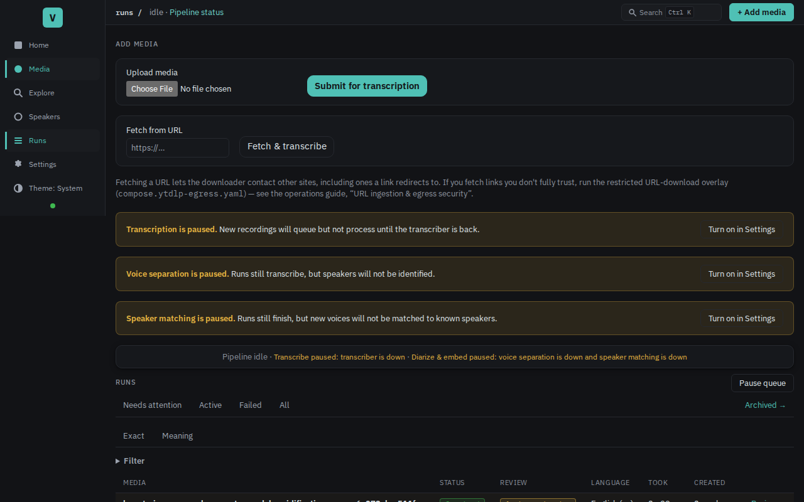
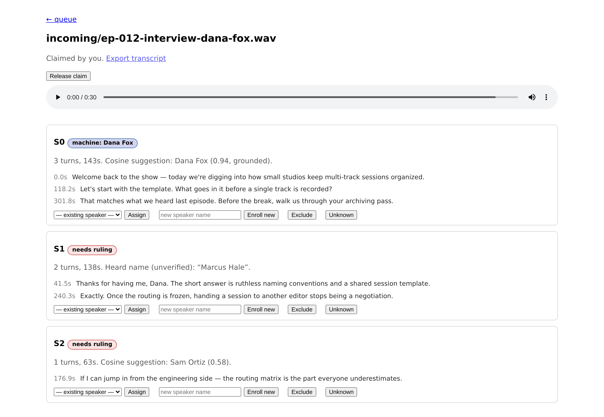

# Voxint

**From sound to intelligence: end-to-end transcription, diarization, and speaker identity with
human-grade quality gates.**

Voxint turns any audio or video file into an enhanced, speaker-attributed transcript:

```
local file · upload · URL → acquire → preprocess
    → transcribe (Whisper) + diarize (pyannote) + embed (TitaNet)
    → LLM transcript enhancement → speaker matching → human adjudication
```

Point it at a local file (`voxint submit`), upload one through the browser, or hand it a
URL (`voxint fetch` / `POST /fetch`) — a yt-dlp download runs as the pipeline's first stage.
URL ingestion is authenticated **admin egress, not a sandbox**: fetch only trusted URLs
unless you run the worker with restricted egress (no route to private / link-local /
metadata addresses). See [docs/operations.md](docs/operations.md#url-ingestion--egress-security).

What makes it different is the orchestration "glue" most pipelines skip:

- **Quality gates at every stage** — non-speech/digital-silence triage before you burn GPU time,
  hallucination soft-tagging and stripping, chunk-completeness checks, outage-vs-data-defect
  taxonomy with explicit retry budgets.
- **Durable state, not vibes** — a compare-and-swap'd run/stage state machine in Postgres; a crash
  at any stage is recoverable, and human pauses are database state, never a held task.
- **Speaker identity done honestly** — pgvector cosine matching against a grown speaker roster,
  a strict *named ≠ grounded* invariant, and machine proposals kept separate from human rulings.
- **A built-in adjudication web UI** — review queue, guarded slot workbench, and an immutable
  decision ledger, served as Jinja + htmx from the same FastAPI app (no Node toolchain).
- **Operable from the browser** — a keyset-paged `/runs` execution-history browser (with a
  per-stage attempt ledger), bounded file upload, and yt-dlp URL ingestion, from the same app.
  Submission is durable-first: a broker outage leaves the run queued for the recovery sweep,
  never lost. A live run can be cancelled (cooperative, exact-revision CAS); a terminal run
  can be soft-archived (reversibly hidden, ledger kept intact) and have its derived audio
  files deleted to reclaim disk (the shared original source is never touched).
- **Measurement harnesses** — **speaker-attribution** scoring, runnable as CLIs:
  name-accuracy against ground truth (McNemar / bootstrap / Wilson), acoustic
  agreement verdicts, and verdict-level ensemble fusion (worked example under
  [`examples/`](examples/README.md)). They score *who spoke*, not *what was
  transcribed* — ASR accuracy / WER measurement is out of scope today.

## The adjudication console

Machine proposals stay separate from human rulings: the review queue lists completed runs
with voices still needing a ruling, and the slot workbench shows each voice's evidence —
grounded cosine matches, unverified LLM-heard names, transcript previews — with
assign / enroll / exclude / unknown actions. (Synthetic demo data pictured.)





## Status

**Pre-alpha.** APIs, schema, and layout may change without notice through the 0.x series.

## Quickstart

Requires Docker Engine with the **Compose plugin ≥ 2.24** (`docker compose
version` — the legacy v1 `docker-compose` binary cannot parse this stack).

> **No NVIDIA GPU? Start here too.** Voxint does not need one — the CPU tier
> runs the full pipeline on plain amd64/arm64 servers and Apple Silicon with
> zero GPU configuration. Follow the same quickstart, then use the
> `compose.cpu.yaml` overlay where the GPU one appears —
> see [No NVIDIA GPU? (CPU tier)](#no-nvidia-gpu-cpu-tier). **AMD GPU?** The
> ROCm tier accelerates transcription on it (4.8× the CPU baseline, amdgpu
> kernel driver is the only host requirement) — use `compose.rocm.yaml` —
> see [AMD GPU? (ROCm tier)](#amd-gpu-rocm-tier). **Apple Silicon Mac?** The
> metal tier runs the model services natively so diarization uses the Apple
> GPU — see [Apple Silicon Mac? (metal tier)](#apple-silicon-mac-metal-tier).

```bash
git clone https://github.com/bengizmo/voxint.git && cd voxint
```

**Guided install (recommended for a first run):**

```bash
./scripts/install.sh
```

It asks for an admin password, a media folder, and a **compute tier** for the
model services (GPU / CPU / none for now) — that's it: all model weights,
diarization included, are vendored into the images, so no Hugging Face account
or token is involved. It generates everything else (including a random
`CSRF_SECRET`), pulls the pinned release images, starts the core stack plus
your chosen tier's model services, waits for the API to report healthy, and
prints the console URL. It is safe to re-run — an existing `.env` is kept
unless you ask to regenerate it (which backs the old one up first), and your
tier choice is remembered (`VOXINT_COMPOSE_TIER`).

**Or configure by hand:**

```bash
cp .env.example .env          # then edit at least VOXINT_PASSWORD
mkdir -p media                # media mount; pre-create so it isn't root-owned
docker compose pull           # prebuilt release images from GHCR
docker compose up -d          # Postgres+pgvector, Redis, migrate, API + review UI, worker, beat
curl http://127.0.0.1:8080/healthz   # default port; matches API_PORT if you changed it
```

The default compose files run the **pinned release images** — even from a
`main` checkout (set `VOXINT_IMAGE_TAG` in `.env` to run a different
release). A one-shot `migrate` service brings the schema to head before the
API and worker start — it showing `Exited (0)` in `docker compose ps -a` is
success, not a crash. If a default port is already in use on your host,
override the published side in `.env` (`POSTGRES_PORT`, `REDIS_PORT`,
`API_PORT`). Details and day-2 operations:
[docs/operations.md](docs/operations.md).

Open the console at `http://127.0.0.1:8080/` (HTTP Basic, the `VOXINT_USER` /
`VOXINT_PASSWORD` you set). On a **fresh install** the console holds you at a
first-run **setup wizard** (`/setup`) — configure media folders, vocabulary, and
optional LLM enhancement in the browser, then finish into a short guided tutorial
on a bundled three-speaker sample. Full walkthrough:
[docs/onboarding.md](docs/onboarding.md).

Once onboarding is complete, browse runs at `/runs` and adjudicate at `/review`.
Feed it work by uploading a file, pointing it at a URL (`docker compose exec api
voxint fetch <url>`), or submitting a local path (`docker compose exec api voxint
submit path/to/file.mp3`, relative to `MEDIA_ROOT`).

To run the GPU model services too (one NVIDIA GPU assumed), just bring up the
GPU overlay — the diarization weights are vendored into the pyannote image
(sha256-pinned from the `pyannote-models-v1` asset release), so no Hugging
Face token is needed (see `services/pyannote/README.md`).

All three services share the one GPU. Their loaded weights total roughly
**3.5–4.5 GB** of VRAM (whisper large-v2 int8 ~1.5 GB, pyannote ~1–2 GB,
TitaNet ~1 GB); budget **~6–8 GB in practice** for Whisper's batch/decode
headroom and three separate CUDA contexts. An 8 GB card is comfortable.
(Per-service figures live in each `services/*/README.md`.)

Then:

```bash
docker compose -f compose.yaml -f compose.gpu.yaml pull
docker compose -f compose.yaml -f compose.gpu.yaml up -d
```

Per-service details, env tunables, and image matrices:
`services/*/README.md`; wire contracts:
[docs/gpu-contracts.md](docs/gpu-contracts.md).

### No NVIDIA GPU? (CPU tier)

The same three model services ship as multi-arch
(amd64 + arm64) `-cpu` images — no GPU, no NVIDIA toolkit, runs on plain
servers and Apple Silicon via Docker Desktop:

```bash
docker compose -f compose.yaml -f compose.cpu.yaml up -d
```

Be honest with your expectations: CPU inference is **orders of magnitude
slower** — a long recording that takes minutes on a GPU takes **hours** on
CPU. The overlay sets `COMPUTE_TIER=cpu`, which scales the pipeline's
timeouts and stage leases so slow-but-healthy runs aren't reclaimed as hung.
Same contracts, same embedding space (TitaNet runs on ONNX Runtime under a
measured-equivalence parity gate). Details:
[docs/operations.md](docs/operations.md#running-without-an-nvidia-gpu-cpu-tier).

### AMD GPU? (ROCm tier)

A hybrid tier for amd64 hosts with an AMD GPU: transcription (whisper) runs
on the GPU via the CTranslate2 ROCm build — same engine, same code path,
measured **4.8× the CPU baseline** on RDNA4 — while diarization and speaker
embedding run the `-cpu` images (MIOpen convolutions currently fail on AMD
consumer GPUs; tracked in
[#4](https://github.com/bengizmo/voxint/issues/4)):

```bash
docker compose -f compose.yaml -f compose.rocm.yaml up -d
```

The host needs **only the amdgpu kernel driver** — no ROCm install, no
container toolkit; the `-rocm` image carries its own ROCm runtime. The
overlay sets `COMPUTE_TIER=rocm` (GPU-speed ASR, CPU-scaled leases for the
rest). Details:
[docs/operations.md](docs/operations.md#running-on-an-amd-gpu-rocm-tier).

### Apple Silicon Mac? (metal tier)

Docker Desktop has no GPU passthrough, so on a Mac the containerized tiers
are CPU-only. The metal tier keeps the core stack in Docker but runs the
three model services **natively** so diarization uses the Apple GPU
(torch-MPS — measured ~5× native-CPU diarization on an M1 Pro, identical
outputs). Transcription stays on the host CPU in v1, so runs remain
transcribe-bound — faster than the Docker CPU tier, not GPU-stack fast:

```bash
./scripts/install.sh                  # choose [M]
./scripts/metal/voxint-metal.sh setup # native venvs + sha-verified weights
./scripts/metal/voxint-metal.sh up    # services under launchd
```

Weights come from the same sha-pinned release assets the images use — still
no Hugging Face account or token. Details:
[docs/operations.md](docs/operations.md#running-on-apple-silicon-metal-tier).

To run the source you checked out instead of the release images, layer the
build overlays (exactly one service owns each build — see
[docs/operations.md](docs/operations.md)):

```bash
docker compose -f compose.yaml -f compose.build.yaml build api
docker compose -f compose.yaml -f compose.build.yaml up -d
```

For development without Docker:

```bash
uv sync --extra dev
uv run pytest tests/unit
uv run uvicorn voxint.api.app:app --reload
```

The scoring harness needs none of the stack — `pip install voxint` gives you
the `voxint score` CLI (pure file-in/file-out, no database or GPU services;
speaker-attribution metrics only, no ASR/WER); see
[`examples/`](examples/README.md).

## Deployment model

Docker-compose-first on a single Linux machine with one NVIDIA GPU:

- `compose.yaml` — Postgres (+pgvector), Redis, one-shot `migrate`, API (+ review UI),
  Celery worker, Celery beat (crash-recovery sweep scheduler)
- `compose.gpu.yaml` — the GPU model services: faster-whisper, pyannote, TitaNet
- `compose.build.yaml` / `compose.gpu.build.yaml` — build-from-source overlays for development

Kubernetes is explicitly **not** required (a future optional enhancement).

## Modularity

ASR, diarizer, embedder, and LLM providers sit behind typed protocols with versioned HTTP
contracts (`/v1/transcribe`, `/v1/diarize`, `/v1/embed`). The LLM enhancement stage speaks to any
OpenAI-compatible endpoint and is optional (`LLM_ENABLED=false` by default). Domain-specific
vocabulary and prompts load from a swappable **domain pack** (`DOMAIN_PACK_PATH`); a neutral
meeting/podcast pack ships as the default.

## License

Apache-2.0. See [LICENSE](LICENSE) and [NOTICE](NOTICE) — vendored model weights are
redistributed under their own licenses with attribution (titanet: CC-BY-4.0; pyannote
segmentation: MIT; WeSpeaker embedding: CC-BY-4.0 — see the provenance files under
`services/*/models/` and the model-asset releases).
