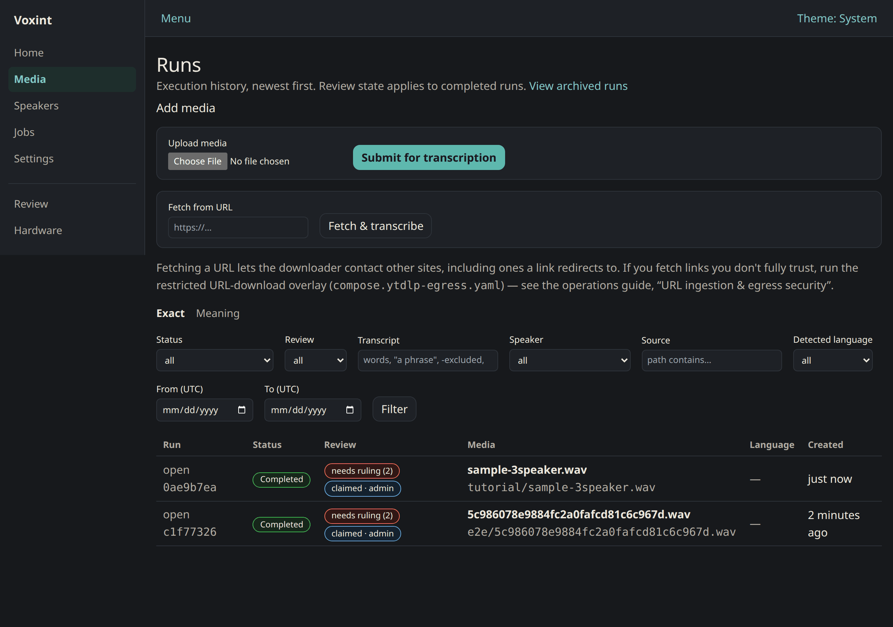
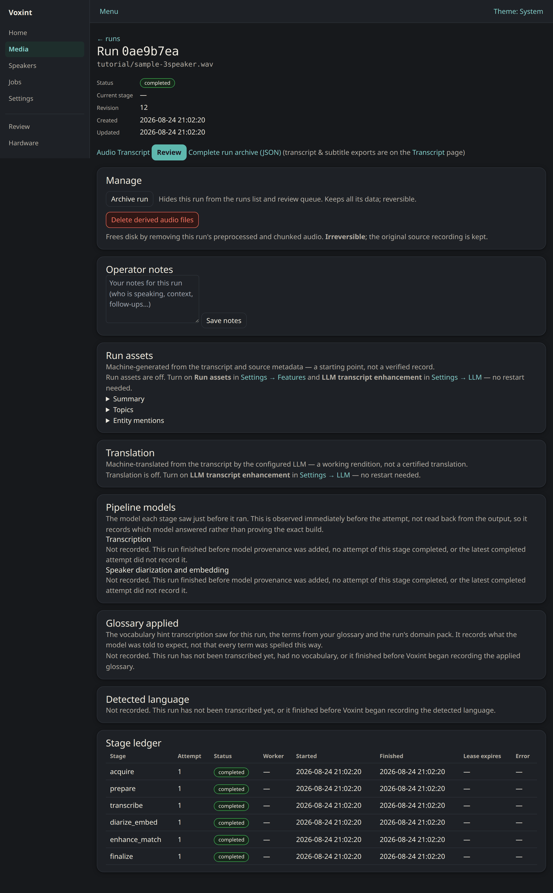

# Add media and manage runs

*How to get a recording into Voxint, follow it through the pipeline, and look
after the run it produces.*

This guide shows you how to get audio or video into Voxint, follow it as it is
processed, and look after the resulting runs. It is written for the person doing
the work, with no coding required for the browser paths.

Everything here happens on your own machine. The console lives at
`http://127.0.0.1:8080/` and asks for the username and password you set during
setup (a standard browser login box). Nothing is uploaded to the internet, and
Voxint does not reach out anywhere on its own. The one exception is the "paste a
URL" feature below, which downloads the file you ask it to.

If you have not installed Voxint yet, start with [setup](../setup.md) and the
[onboarding walkthrough](../onboarding.md). To read and correct results once a
run finishes, see [reviewing and adjudicating](reviewing-and-adjudicating.md).

## The short version

There are three ways to add a recording:

1. **Upload it in your browser.** The simplest way, and the best place to start.
2. **Paste a URL.** Voxint downloads the audio or video for you.
3. **Point at a local file or a watched folder.** For files already sitting in
   the media area Voxint is configured to read.

Once a recording is in, Voxint runs it through six stages (download, prepare,
transcribe, identify speakers, enhance, and finalize), and you can watch the
progress on the run's page. When it finishes, you review it. Along the way you
can requeue a run that failed, cancel one that is still going, tuck a finished
one out of sight, free up disk space, and jot down notes.

---

## Add media

### 1. Upload in the browser (start here)

This is the most direct way, and it needs nothing but the file on your computer.

1. Open **Runs** (`http://127.0.0.1:8080/runs`).
2. At the top of the page, find the **Upload media** control. Click it and pick
   an audio or video file.
3. Click **Submit for transcription**.

Voxint saves the file and starts a run straight away. You are taken to the run's
page, where you can watch it move through the pipeline (see
[Watch a run](#watch-a-run) below).

A couple of honest notes:

- **There is a size limit.** Very large uploads are rejected so a single file
  can't exhaust the server. If your file is over the limit, use one of the two
  methods below instead, or split the recording.
- The upload is durable the moment Voxint accepts it. Even if the task system is
  briefly busy, your run is safely queued and will start on its own, so you don't
  need to resubmit.

### 2. Paste a URL

If your recording lives on a web page, you can give Voxint the link and let it
fetch the file. This uses a tool called yt-dlp as the run's first stage.

1. On the **Runs** page, find the **Fetch from URL** box.
2. Paste the link and click **Fetch & transcribe**.

Voxint downloads the media, then processes it exactly like an uploaded file.

**Please read this before you paste a link you don't fully trust.** Fetching a
URL is not a locked-down sandbox. It is Voxint reaching out to the internet on
your behalf, with the same access your machine has, and it follows redirects to
wherever the link points. So:

- Only fetch links from sources **you trust**.
- If you need to fetch links you are unsure about, run the optional restricted
  download overlay, which pins the downloader to vetted public addresses. The
  full explanation is in
  [operations · URL ingestion & egress security](../operations.md#url-ingestion--egress-security).

If you don't want this feature available at all, you can turn **"Download media
from a URL"** off in **Settings**; see
[settings and troubleshooting](settings-and-troubleshooting.md). When it is off,
the Runs page simply says URL ingestion is disabled and the box does not appear.

### 3. A local file or a watched folder

Voxint can also work from files that already live in its **media area**, the
folder (called `MEDIA_ROOT`) that you told Voxint it may read during setup.

This is the one point that trips people up, so here it is plainly: **these paths
are inside Voxint's configured media area, not anywhere on your computer.**
Voxint can only see files you have placed under that area. A path like
`interviews/session-1.mp3` means "the file `session-1.mp3` in the `interviews`
sub-folder of the media area", not an arbitrary location on your disk.

There are two ways to use the media area.

**Register a folder (set it up once, in the browser).** In **Settings → Media
folders** you can browse the folders inside your media area and register the ones
Voxint should work with. You can also give each folder a
[domain pack](../domain-packs.md), which tunes the vocabulary for that kind of
recording. The folder browser is also part of first-run setup; see the
[onboarding walkthrough](../onboarding.md) and
[settings and troubleshooting](settings-and-troubleshooting.md).

**Turn on automatic ingest (optional).** Registering a folder does not, on its
own, start anything. It tells Voxint where your media lives and (with the
setup wizard's scan) lets you queue what is already there. To have Voxint keep
watching and **pick up new recordings on its own**, turn on **Automatic ingest**,
the toggle just below the folder list in **Settings → Media folders**. It is
**off by default**. Once it is on, Voxint checks your registered folders on a
schedule and starts a run for each new recording it finds. Files it has already
picked up are skipped, so you can drop a whole batch of interviews in and let them
queue themselves. The toggle applies immediately, no restart. A status line right
there shows the last check ("Last checked …, picked up 3 new files; 12 already
known; 2 waiting to settle").

Two things help it behave the way you expect:

- **Copy files in with a move/rename when you can.** Voxint waits until a file has
  stopped changing before it ingests it, so a recording that is still being copied
  in is not picked up half-written. The most reliable way to add files is to copy
  them somewhere else first and then **move** (rename) them into the watched
  folder in one step.
- **"Already known" means already added, not necessarily finished.** A file is
  skipped once Voxint has a record of it, including one whose earlier run
  **failed**. The watcher will not retry a failed run; requeue it yourself from the
  run's detail page. A file you **rename or move** looks new and will be picked up
  again.

#### Describe a recording with a sidecar file

When automatic ingest picks a recording up, you can hand Voxint some context
along with it: a title, the names of the people speaking, working notes, or a
domain pack. You do this with a **sidecar file**, a small text file that
travels next to the recording and is written in a simple `key: value` format
called YAML.

Say your recording is `interview.wav`. Create a plain-text file named
`interview.wav.yaml` in the same folder, with any of these lines:

```yaml
title: Interview with Jane Doe
speakers:
  - Jane Doe
  - John Smith
domain_pack: hvac
notes: |
  Recorded at the spring conference.
  Audio is a little echoey after minute 40.
```

Every line is optional. Here is what each one does:

| Key | What it does |
|---|---|
| `title` | Becomes the recording's display name in the queue and on the run page. |
| `speakers` | Names of people likely in the recording. Voxint treats them as trusted name hints when it suggests speaker names during review, so these names surface sooner and more confidently. |
| `domain_pack` | Picks the [domain pack](../domain-packs.md) for this one recording. It wins over the folder's pack setting. |
| `notes` | Free text, saved as the run's operator notes. |

A few rules worth knowing:

- **Naming.** `interview.wav.yaml` (the full file name plus `.yaml`) always
  works. The shorter `interview.yaml` also works, as long as only one recording
  in the folder is named `interview.something`; with both a `interview.wav` and
  an `interview.mp4` present, Voxint cannot tell which one you meant and will
  wait until you rename the sidecar to the full form. If both forms exist, the
  full-name one wins. The ending must be `.yaml`, not `.yml`.
- **Drop the sidecar with or before the recording.** The sidecar is read once,
  at the moment the recording is picked up, and its contents are frozen onto
  that run. A sidecar that arrives after the recording was already picked up
  does nothing, and editing the file later changes nothing.
- **A broken sidecar never loses your recording.** If the sidecar has a
  problem (a typo in the format, a wrong kind of value, an unknown domain
  pack), Voxint holds the recording rather than guessing. The status line
  under **Settings → Media folders** tells you a sidecar needs fixing; fix the
  file and the next check picks the pair up.
- **Extra lines are fine.** Keys Voxint does not recognize are kept with the
  run for reference and otherwise ignored, so a sidecar written by another
  tool can carry its own bookkeeping without getting in the way. Anything in
  the file is stored with the run, so keep private things out of it.

**Submit a single file (for people comfortable with the terminal).** If you would
rather kick off one file by hand, Voxint has a command line. These commands are
for the **Docker install**: they run inside the running `api` container. (On the
docker-free [native macOS preview](../native-macos-preview.md) there is no
container to `exec` into; use the browser upload, which does the same thing.)

```bash
# Submit one file already sitting in the media area (path is relative to MEDIA_ROOT):
docker compose exec api voxint submit path/to/file.mp3

# Fetch and process a URL from the command line:
docker compose exec api voxint fetch <url>
```

`voxint submit` is a **one-off**: it processes that single file once. With
**Automatic ingest** turned on, a registered folder is standing: set it up once
and everything you drop in gets picked up. Most non-technical operators will never
need the command line; the browser upload and automatic ingest cover the same
ground.

---

## Watch a run

Every run has its own page (open it from the **Runs** list, then click **open** on
a row). The page shows where the run is and what has happened.



A run moves through **six stages**, in order:

1. **acquire**: download or locate the source file.
2. **prepare**: convert the audio into the form the models need.
3. **transcribe**: turn speech into text (Whisper).
4. **diarize & embed**: work out who spoke when, and capture each voice's
   fingerprint (pyannote + TitaNet).
5. **enhance & match**: tidy the transcript and match voices to known speakers.
6. **finalize**: assemble the finished result.

Near the bottom of the run page, the **stage ledger** lists each attempt at each
stage: when it started, when it finished, and any error. This is the detailed
record; you rarely need it unless something went wrong.



The run's overall **status** tells you the headline:

- **queued**: accepted and waiting to start. It will begin on its own.
- **running**: a stage is working right now.
- **completed**: all stages finished. Time to review it.
- **failed**: a stage hit an error it could not get past.

A failed stage is retried automatically a few times, with a growing pause
between attempts. Only after those retries are exhausted does the run land in
**failed**, at which point it waits for you (see below). If the failure was in
the **transcribe** or **diarize & embed** stage, the most common cause is that
the model services were not running; the run page says so and tells you how to
start them.

### The recording's language

Voxint listens to each recording and works out what language it is in, then
shows that on the run page as **Detected language**, for example "Spanish (es)".
It picks one language for the whole recording. Next to the language it may show a
**detection score**: this is how sure the model is about the language it chose,
not how accurate the transcript is. The **Runs** list has a **Language** column
so you can see every recording's language at a glance, and a **Detected
language** filter to show only recordings in one language. Recordings you
processed with an older version of Voxint have no language recorded and show a
dash.

---

## Manage runs

The run page gives you a few controls for looking after a run.

### Requeue a failed run

If a run failed, a **Requeue** button appears. Click it to retry from the stage
that failed. This is handy once you have fixed whatever caused it (for example,
started the model services). If you had the page open in an old tab and something
changed underneath you, the requeue is safely refused rather than acting on stale
information; just reload and try again.

### Cancel a run that is still going

While a run is **queued** or **running**, a **Cancel run** button is available.
Cancelling is **cooperative**, not a hard stop: the stage that is running right
now finishes first, and then no further stages start. Your media and any partial
results are left in place; cancelling does not delete anything.

### Archive and un-archive a finished run

Once a run is finished (completed, failed, or cancelled), you can **Archive** it.
Archiving **reversibly hides** the run from the Runs list and the review queue.
Nothing is deleted: every bit of its data, including the record of your review
decisions, stays intact. To bring it back, open it (the archived view is linked
from the top of the Runs page) and click **Un-archive**.

You have to cancel a live run before you can archive it.

### Delete derived audio to reclaim disk

Voxint keeps some working audio files while it processes a run. On a finished
run you can click **Delete derived audio files** to remove them and free up disk
space. This is **irreversible**, but it is also **safe in the important sense**:
it only removes Voxint's own processed copies. It **never touches the original
recording**, and it leaves the transcript and your decisions alone. If you ever
need the audio back, you can re-run from the original source.

### Add notes

Each run has an **Operator notes** box. Use it for anything you want to remember
about the recording: who is speaking, the context, follow-ups to do later.
Notes are yours; they are kept separate from any information Voxint scraped about
the source, so the two are never confused.

---

## Next: review the results

When a run reaches **completed**, the last step is to read through it, fix any
words the transcript got wrong, and confirm who each speaker is. That is covered
in [reviewing and adjudicating](reviewing-and-adjudicating.md).

## Related guides

- [Review & adjudicate](reviewing-and-adjudicating.md)
- [Manage speakers & export](managing-speakers-and-exporting.md)
- [Settings & troubleshooting](settings-and-troubleshooting.md)
- [Setup](../setup.md): install Voxint on your OS and hardware.
- [First-run walkthrough](../onboarding.md): the setup wizard and guided tutorial.
